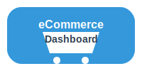

# eCommerce Dashboard

A modern, responsive eCommerce dashboard built with React Native that supports Android, iOS, and web platforms. This application provides comprehensive management tools for users, products, and sales, with support for English and Chinese languages.



## Features

- **User Management**: Add, edit, and delete user accounts
- **Product Management**: Manage product inventory, details, and stock levels
- **Order Management**: Process and track orders with status updates
- **Analytics Dashboard**: Visual representations of sales and inventory data
- **Multilingual Support**: Full support for English and Chinese languages
- **Responsive Design**: Works on mobile (Android/iOS) and web platforms
- **Local Database**: Data storage using SQLite for offline functionality

## Project Setup

### Prerequisites

- Node.js (v14 or higher)
- npm or yarn
- Expo CLI
- Android Studio (for Android development)
- Xcode (for iOS development)

### Installation

1. Clone the repository:
```
git clone <repository-url>
cd dashboard-ecommerce
```

2. Install dependencies:
```
npm install
```

3. Start the development server:
```
npm start
```

4. Follow the Expo CLI instructions to launch on your desired platform:
   - Press `a` to open on Android
   - Press `i` to open on iOS
   - Press `w` to open on Web

## Technology Stack

- **React Native**: Core framework for cross-platform development
- **Expo**: Development toolchain and runtime
- **SQLite**: Local data storage
- **React Navigation**: Navigation management
- **react-native-gifted-charts**: Chart visualization
- **react-i18next**: Internationalization
- **@expo/vector-icons**: Icon library

## Project Structure

```
dashboard-ecommerce/
├── src/
│   ├── assets/           # Static assets like images and fonts
│   ├── components/       # Reusable UI components
│   ├── contexts/         # React context providers
│   ├── database/         # SQLite implementation
│   ├── hooks/            # Custom React hooks
│   ├── localization/     # i18n translations
│   ├── navigation/       # Navigation configuration
│   ├── screens/          # Application screens
│   ├── services/         # Backend services
│   └── utils/            # Utility functions
├── public/              # Static files for web deployment
├── App.tsx             # Main application entry point
├── package.json        # Dependencies and scripts
└── README.md           # Project documentation
```

## Key Components

- **AppNavigator**: Manages the navigation flow between screens
- **ThemeContext**: Provides theming support with light/dark mode
- **DatabaseService**: Handles all local database operations
- **i18n**: Manages language translations
- **Card, Button, StatsCard**: Reusable UI components

## Building for Production

### Android

```
expo build:android
```

Choose between APK or Android App Bundle based on your distribution needs.

### iOS

```
expo build:ios
```

You will need an Apple Developer account to build for iOS.

### Web

```
expo build:web
```

The web build can be deployed to services like Netlify, Vercel, or GitHub Pages.

## Multilingual Support

The app uses react-i18next for managing translations. Currently supported languages:

- English (default)
- Chinese (中文)

Language settings can be changed from the Settings screen. The app will remember the user's language preference.

The translation files are stored in `src/localization/i18n.ts`.

## Database Schema

The application uses SQLite for local data storage with the following main tables:

- **users**: Stores user information
- **products**: Contains product details and inventory
- **orders**: Tracks customer orders
- **order_items**: Links products to orders with quantity and pricing

## License

This project is licensed under the MIT License.

## Acknowledgements

- Icons provided by Expo Vector Icons and Ionicons
- Chart visualization by react-native-gifted-charts
